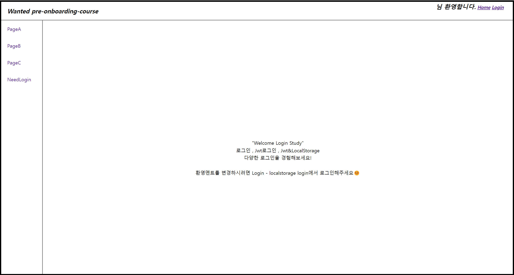

# JWT & LocalStorage 를 이용한 Auto Login 구현
다양한 로그인 을 구현해본 웹 (Mocking)<br/>
Nav바를 통해 페이지 전환을 하는 웹 <br/>
Nav바 중 NeedLogin은 로그인이 되었을때만 접근가능한데 로직을 어떻게 설계해야할까? 에 대한 답

배포링크 보러가기 🔍
<h3>https://chanwoo-jeong.github.io/wantedLogin</h3>

## 📌 프로젝트 설명
### `진행 동기` 
 - 취준을 준비하던 중 wanted에서 로그인에 관련된 강의를 무료로 진행한다고 했다.
 - 커리큘럼을 보니 JWT , 세션 등 로그인에 대해서 깊이 배운다고 하여 신청하게 됐다.
 - 배*개발자 분이 강의해주시는데 그동안 혼자 독학했던 것보다 난이도가 꽤나 높아서 좋았다.
 - 총 4번의 강의를 진행했지만 배운 것들을 토대로 한번에 합쳐서 하나의 프로젝트로 만들어 보고싶었다.
 - 배운것들을 전체 종합하여 나만의 로그인 웹페이지를 제작해보기로 했다!

### `진행 기간` 
 - 2023.03.06 ~ 진행중 

### `사용기술`
- Typescript 기반 React , Styled-Component , Recoil , Router V6
- Jwt , LocalStorage

### `기능설명`
- 왼쪽 Nav 바를 통해 page를 이동할 수 있다.
  
- Nav 바 중 NeedLogin은 Login해야만 접근할 수 있다.
- ""님 환영합니다 는 localStorage login을 하면 바뀐다.
- login에는 일반로그인 , JWT로그인 , JWT & localStorage Login 3가지 옵션이 있다.
- localStorage login을 하면 로그인 정보가 저장되며 NeedLogin 페이지에 접근가능하다.
- Logout을 누르면 localStorage에 저장됐던 정보가 삭제되며 로그아웃 , 페이제접근 불가하다.

### `성장한점`
- Router v6 Outlet 을 이용해 페이지 전환시 전체 Layout 재랜더링이 아닌 내부 Page만 재랜더링할 수 있다.
- Jwt , refresh_Token , access_Token , LocalStorage에 대한 개념을 이해했다. <br/>
- page별 접근가능 권한을 Nav바 Auth를 통해 저장했다. <br />이에 따라 Nav바 확장성과 Auth를 통해 로그인이 필요한 페이지의 접근을 제어할 수 있게 되었다.
- 
  ```javascript
    const NavPart = [
    {
        part: "PageA",
        pathname: `/PageA`,
        Auth: false
    },
    {
        part: "PageB",
        pathname: `/PageB`,
        Auth: false
    },
    {
        part: "PageC",
        pathname: `/PageC`,
        Auth: false // 로그인 필요없음 => false
    },
    { 
        part: "NeedLogin", 
        pathname: `/needLogin`, 
        Auth: true // 로그인 필요함 => true
    }
    ];
  ```
- 로그인을 하게되면 Recoil을 통해 로그인 여부를 전역으로 관리할 수 있게 되었다. <br/>또한 로그인이 해제되면 NeedLogin 페이지의 접근을 Recoil을 통해 즉각 통제한다.
  ```javascript
    import { atom } from 'recoil';

    export const isLogined = atom({
    key: 'isLogin',
    default: false,
    });
  ```
- localstorage 를 이용하여 발급한 token값을 저장 , 불러오기 , 삭제할 수 있다.
 ```javascript
    export const saveAccessTokenToLocalStorage = (accessToken: string) => {
    localStorage.setItem('accessToken', accessToken)
    }

    export const getAccessTokenFromLocalStorage = (): string => {
    return localStorage.getItem('accessToken') || ''
    }

    export const DeleteAccessTokenFormLocalStorage = () =>{
    return localStorage.removeItem('accessToken')
    }
  ```

